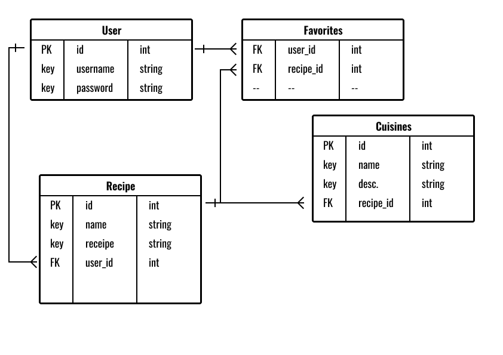

# Recipe List

- Receipe list is a full-stack python-flask-sql web application.

- Logic in Python, Database in SQLAlchemy, Templating in Flask, Rendered in Jinja2

### Run

1. `pip3 install -r requirements.txt` to install dependencies
2. `source env/bin/activate` to activate virtual environment
3. `python3 main.py` to run application
4. `localhost:5000` in browser to view application
5. `dectivate` to deactivate virtual environment

### ERD Document

 